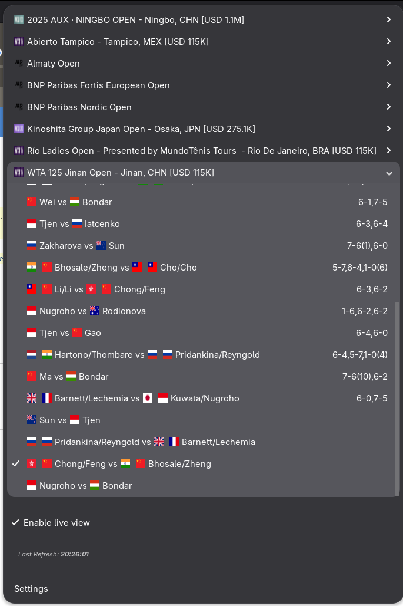
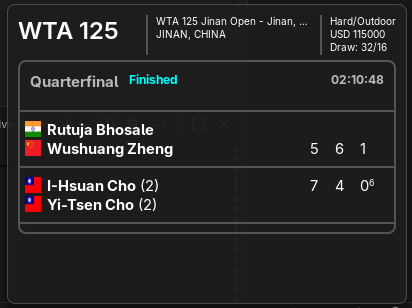
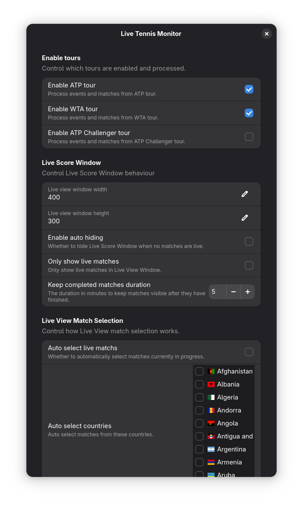
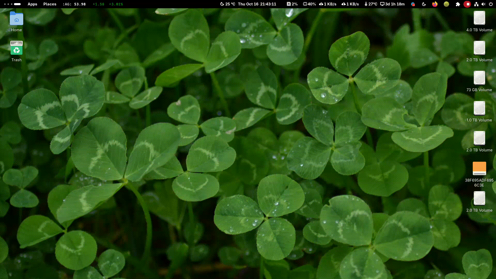

# gnome-live-tennis

A Gnome extension that helps you show live tennis scores. Service provider: [ATP](http://atptour.com) and [WTA](http://wtatennis.com).

The actual extension is hosted [here](https://extensions.gnome.org/extension/8674/live-tennis-monitor/).

# Screenshots

# Documentation

## Overview

You need to enable one or more of the ATP, WTA and ATP Challenger tours depending upon your interest in extension settings. Once enabled the tournaments and matches become visible in extension popup menu.

Matches can be selected from the popup menu. Once selected matches become visible in Live Score Window. The Live Score Window cycles through all the matches. You can also configure auto selection based on certain configuration settings available on Settings page.

## Enable Tours

## Live Scores Window

